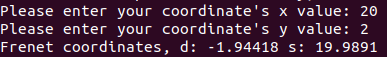

# Frenet Coordinate Transformation Tool

## Context

In autonomous driving, the Frenet coordinate system is often used. In the Frenet system, the coordinate of an object is defined by two values: the longitudinal and the lateral position of the object with respect to a reference line. This tool calculates the frenet coordinates based on a finite list of cartesian coordinates

---

## Documentation for Frenet Coordinate Transformation Tool

### Prerequisites for this tool:

- Linux (e.g Ubuntu)
- [Bazel](https://bazel.build/)

### Used libraries

- [Tino Kluge's cubic spline interpolation library](https://kluge.in-chemnitz.de/opensource/spline/)
- Google Test (gtest) library
- Google Protobuf library

### How to run the tool:

- Run the binary: ```bazel run :frenet_coordinate_transformer```
- Run the unit tests: ```bazel test :frenet_coordinate_transformer_test```
- Build entire code: ```bazel build :all```

When running the binary the user will be prompted to enter coordinates to compare to the reference line created by the provided reference points ("reference_points.pb.txt"). It will look like this:



### Explanation of the functions of the classes ```ProtobufMessageParser``` and ```ReferencePointsTransformer```

- ```CheckProtobufVersion()``` -> Checks if the correct protobuf version is used
- ```ParseProtoMessageFromTxtFile()``` -> A generic template function used to parse message information from txt files. Automatically fills the message information into an object of a user defined type
- ```GetReferenceLine()``` -> Returns the generated reference line (spline)
- ```CalculateFrenetCoordinates()``` -> Calculates the frenet coordinates of a cartesian coordinate based on the reference line (more in detail explanation in the improvements section)
- ```SetFrenetCalculationBoundaries()``` -> Sets the lower and upper bound for the reference line to which the frenet coordinates will be computed to avoid long calculations for points very far along the reference line. Default bounds are set in the class's constructor. Bounds are the first and last point of the reference points
- ```CreateReferenceLine()``` -> Creates the reference line from the reference points
- ```CalculateEuclideanDistance``` -> Calculates the euclidean distance of two points
- ```CalculateSign()``` -> Calculates the sign of the d-value for the frenet coordinate. E.g left or right side from the reference line.
- ```CalculateFrenetCoordinates()``` -> Calculates the Frenet Coordinates based on the provided reference points and the user input coordinates
